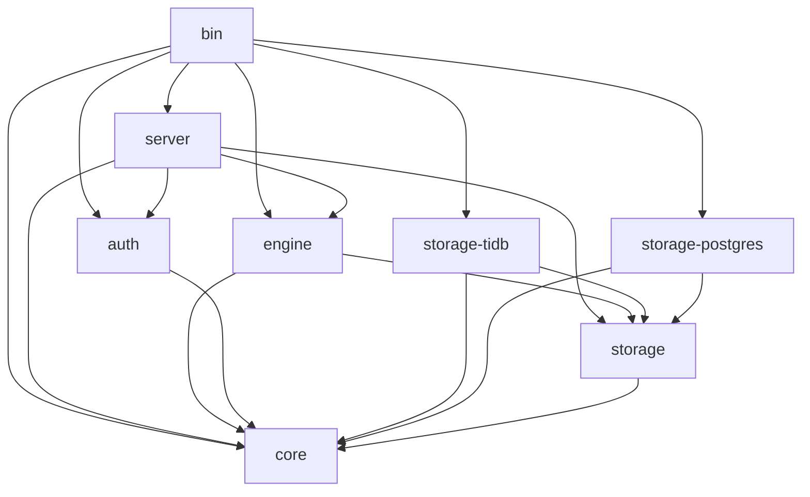
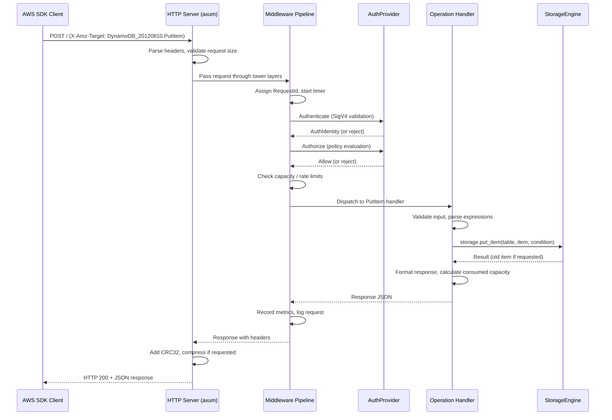

# extenddb — High-Level Design

**Version:** 1.0
**Date:** 2026-04-03
**Status:** Active

## 1. Architecture Overview

extenddb (ExtendDB) is a standalone async Rust application structured as a Cargo workspace. It receives DynamoDB wire protocol requests over HTTP, authenticates and authorizes them via SigV4 and the built-in IAM engine, executes operation logic in a backend-agnostic core, and delegates persistence to a pluggable storage engine. TiDB is the default product backend; PostgreSQL is an explicit alternate backend.

```
┌─────────────────────────────────────────────────────────────────────┐
│                     AWS SDK Client (any language)                   │
│              HTTP POST + SigV4 Authorization header                 │
└──────────────────────────────┬──────────────────────────────────────┘
                               ▼
┌─────────────────────────────────────────────────────────────────────┐
│                        HTTP Server (axum/tower)                     │
│  TLS · request size limits · rate limiting · gzip · CRC32           │
│  routing: X-Amz-Target → operation handler                          │
└──────────────────────────────┬──────────────────────────────────────┘
                               ▼
┌─────────────────────────────────────────────────────────────────────┐
│                      Middleware Pipeline (tower layers)             │
│  RequestId → Logging → Auth → Capacity → Metrics                    │
└──────────────────────────────┬──────────────────────────────────────┘
                               ▼
┌─────────────────────────────────────────────────────────────────────┐
│                     Engine (async operation handlers)               │
│  Operation dispatch · response formatting · stream record assembly  │
├─────────────────────────────────────────────────────────────────────┤
│                     Core (pure sync — no async runtime)             │
│  Types · expression parsing/evaluation · validation · capacity      │
│  error types · configurable limits                                  │
└──────────────┬───────────────────────────────────┬──────────────────┘
               ▼                                   ▼
┌──────────────────────────┐         ┌────────────────────────────────┐
│     AuthProvider trait   │         │     StorageEngine trait        │
│  ┌────────────────────┐  │         │  ┌────────────────────────┐    │
│  │ Built-in SigV4     │  │         │  │ TiDB (sqlx MySQL)      │    │
│  │ Local IAM engine   │  │         │  │ PostgreSQL alternate   │    │
│  │ Session policies   │  │         │  │ Future backend crates  │    │
│  └────────────────────┘  │         │  └────────────────────────┘    │
└──────────────────────────┘         └────────────────────────────────┘
```

## 2. Cargo Workspace Structure

```
extenddb/
├── Cargo.toml                    # Workspace root
├── extenddb.sample.toml          # Example configuration file
├── docs/                         # Design documentation (this folder)
│
├── crates/
│   ├── core/                     # Pure types, limits, validation, expressions, metrics
│   ├── engine/                   # DynamoDB operation handlers and capacity helpers
│   ├── storage/                  # Object-safe storage, management, diagnostics traits
│   ├── storage-tidb/             # Default TiDB backend, native DDL, TTL, BR, workers
│   ├── storage-postgres/         # Explicit PostgreSQL alternate backend
│   ├── auth/                     # Built-in SigV4 provider and IAM policy evaluator
│   ├── cache/                    # Shared stale-while-revalidate cache primitive
│   ├── server/                   # Axum server, DynamoDB route, management API, console
│   └── bin/                      # CLI, config parsing, daemon lifecycle
```

### 2.1 Crate Dependency Graph



**Key principle:** `core` depends on nothing in the workspace and has no async runtime — it is pure sync Rust (types, expressions, validation, capacity, errors). `storage` depends only on `core`. `engine` depends on `core` + `storage` and contains the async operation handlers. Backend crates depend on `storage` + `core`. `auth` depends on `core`. `server` depends on `core` + `storage` + `auth` + `engine`. `bin` wires everything together.

## 3. Request Lifecycle



## 4. Key Design Decisions

### 4.1 Cargo Workspace with Crate Boundaries

**Decision:** Structure as a Cargo workspace with focused crates and explicit backend crates.

**Rationale:**
- Compile-time enforcement of dependency boundaries — the storage trait crate physically cannot depend on TiDB or PostgreSQL
- `core` is pure sync Rust with no async runtime — types, expressions, validation, capacity, errors
- `engine` contains async operation handlers that depend on `core` + `storage`, keeping the async boundary explicit
- Independent testing — `cargo test -p extenddb-core` needs no database and no async runtime
- Faster incremental builds — changing a backend doesn't recompile the expression parser
- Clean extension points — adding another backend is a new crate, with no storage-trait dependency leak into core
- Lean dependency trees — core has no async runtime, no database drivers, no HTTP framework

### 4.2 axum + tower for HTTP

**Decision:** Use axum as the HTTP framework with tower middleware layers.

**Rationale:**
- axum is the de facto standard for async Rust HTTP servers, built on top of hyper and tower
- tower's `Layer` and `Service` traits provide composable middleware that maps directly to the DynamoDB middleware pipeline (auth, capacity, metrics, logging)
- Native async/await with tokio — no blocking threads, efficient connection handling
- Mature ecosystem with TLS (rustls), compression, and graceful shutdown support
- axum's extractor pattern cleanly maps to parsing DynamoDB request headers and bodies

### 4.3 Trait-Based Pluggability

**Decision:** Define `StorageEngine` sub-traits with explicit `BoxFuture` return types for object-safe dynamic dispatch. Define `AuthProvider` and `CredentialStore` using `#[async_trait]` for object-safe dynamic dispatch.

**Rationale:**
- **Storage (`BoxFuture` + `Arc<dyn>`):** Storage backends are selected at runtime through `Arc<dyn StorageEngine>`. The explicit `BoxFuture` signatures keep the traits object-safe without relying on `#[async_trait]`, and data-plane methods tie the future lifetime to borrowed request metadata so implementations do not clone keys, expression maps, resolved index info, or transaction batches just to cross an async boundary.
- **Auth (`#[async_trait]` + `Arc<dyn>`):** Both `AuthProvider` and `CredentialStore` use `#[async_trait]` for object safety. Auth is called once per request and involves crypto operations (SigV4 HMAC-SHA256, policy evaluation) that dwarf the cost of a single boxed future allocation. Using `#[async_trait]` makes `AuthProvider` object-safe, allowing `Arc<dyn AuthProvider>` in the server crate without enum wrappers. `CredentialStore` uses `#[async_trait]` for the same reason: it allows `Arc<dyn CredentialStore>` inside `BuiltinAuthProvider`, avoiding a generic parameter that would propagate up through the auth provider.
- Avoids monomorphization bloat from generic parameters threaded through the entire codebase
- Clean testing — mock implementations for unit tests, real backends for integration tests

### 4.4 Expression Engine in Core (No Database Dependency)

**Decision:** The expression parser and evaluator live in the `core` crate and operate on in-memory `AttributeValue` types.

**Rationale:**
- Expressions are DynamoDB-specific logic, not storage-specific — `FilterExpression` is evaluated after items are fetched, `ConditionExpression` is evaluated against the current item before a write
- Keeping expressions in core means every storage backend gets the same expression behavior for free
- The storage backend only needs to handle `KeyConditionExpression` translation to its native query language (e.g., SQL WHERE clauses for partition key equality + sort key range)
- This matches how DynamoDB actually works: filter expressions are applied after the read, not pushed down to the storage layer

**Important:** While the expression evaluator lives in `core`, `ConditionExpression` evaluation for writes is called by the storage backend inside its transaction (after `SELECT FOR UPDATE`). The storage backend imports `core::expression::evaluate_condition` and calls it within the transaction to prevent TOCTOU races. `FilterExpression` evaluation happens in the core handler after items are returned — this is safe because filters are read-only post-processing.

### 4.5 Configuration: TOML + Env Vars + CLI

**Decision:** Layered configuration with precedence: CLI flags > env vars > config file > defaults.

**Rationale:**
- TOML config file for VM deployments (managed by Ansible/Chef, reviewed in PRs)
- Env var overrides for Kubernetes (ConfigMaps, Secrets)
- Minimal CLI flags (`--config`, `--version`, `--validate-config`)
- Standard pattern used by Consul, Vault, Vector, and most production Rust services
- Implemented with `config` crate + `serde` + `clap`

### 4.6 Async All the Way Down

**Decision:** The entire stack is async (tokio runtime), including the storage trait.

**Rationale:**
- The original pg_dynamodb extension was forced into blocking mode by PostgreSQL SPI constraints. As a standalone process, we have no such limitation
- Async I/O is essential for handling thousands of concurrent connections efficiently
- sqlx provides async SQL drivers for the TiDB MySQL-compatible endpoint and for the PostgreSQL alternate backend
- The storage trait being async allows backends that use network I/O (e.g., a future DynamoDB-backed backend for testing, or a distributed storage backend)

### 4.7 Read Consistency Routing

**Decision:** The engine passes DynamoDB `ConsistentRead` into storage read
methods. Backends can use their native strong/default-read routing without
inventing delay queues or app-side consistency machinery.

**Rationale:**
- DynamoDB's eventual consistency is a read-path choice, not an artificial
  background delay.
- Strongly consistent reads remain the authoritative path. Writes and
  `ConsistentRead=true` reads stay on the backend's strong data path.
- Backends without a native replica/follower-read path may serve all reads
  strongly; that is stricter than DynamoDB and compatible with clients.
- TiDB uses a dedicated default-read pool with native `closest-adaptive` follower
  read for default reads. TiDB follower read remains strongly consistent, but it
  lets TiDB reduce leader and cross-AZ read pressure for larger read-only
  statements. TiDB can also use session-level stale read on the default-read
  pool when `storage.tidb.default_read_staleness_seconds` is configured.
- Capacity calculations always reflect the requested consistency mode
  (0.5 RCU for eventually consistent, 1.0 RCU for strongly consistent)
  regardless of the backend's physical routing choice.

## 5. Data Flow

### 5.1 Write Path (PutItem Example)

```
1. HTTP layer receives POST, extracts X-Amz-Target: DynamoDB_20120810.PutItem
2. Middleware: assign RequestId, authenticate (SigV4), authorize (policy check)
3. Middleware: check capacity (reject if ProvisionedThroughputExceeded)
4. Dispatch to PutItem handler in engine
5. Validate input: table name, item size, key attributes present, attribute types
6. If ConditionExpression present: parse expression into AST
7. If streams enabled: construct StreamRecord (will be persisted atomically with data)
8. Call storage.put_item(table_name, item, condition, expression_context, stream_record)
   - Storage backend: BEGIN transaction
   - SELECT FOR UPDATE existing item (for condition check + ReturnValues)
   - If condition: call core's evaluate_condition() against existing item INSIDE the transaction
   - If condition fails: ROLLBACK, return ConditionFailed { old_item }
   - Insert/upsert item
   - If GSIs exist: update backend-specific secondary-index state. TiDB uses native generated-column secondary indexes maintained by the base-table write; PostgreSQL uses companion state.
   - If stream_record provided: INSERT stream record (within same transaction)
   - COMMIT
9. Calculate consumed capacity (item size → WCU)
10. Format response (Attributes if ReturnValues=ALL_OLD, ConsumedCapacity if requested)
11. Middleware: record metrics, log request
12. HTTP layer: add CRC32 header, compress, send response
```

> **Key invariant:** Condition evaluation, data write, secondary-index maintenance, and stream record capture are transactionally consistent. PostgreSQL performs companion-table updates in the same transaction; TiDB delegates secondary-index maintenance to native TiDB indexes on the base table. This prevents TOCTOU races (another request modifying the item between condition check and write) and ensures atomicity of stream capture.

### 5.1b Write Path (UpdateItem — Additional Detail)

UpdateItem is more complex than PutItem because the storage backend must also apply the update expression inside the transaction:

```
8. Call storage.update_item(table_name, key, updates, condition, expression_context, stream_capture)
   - Storage backend: BEGIN transaction
   - SELECT FOR UPDATE existing item by primary key
   - If no existing item: create a new item containing only the key attributes (UpdateItem is an upsert)
   - If condition: call core's evaluate_condition() against existing item (or empty key-only item) INSIDE the transaction
   - If condition fails: ROLLBACK, return ConditionFailed { old_item }
   - Call core's apply_update(actions, &mut item, ctx) → modified item
   - Validate modified item (size limits, key attributes unchanged)
   - INSERT/UPDATE the modified item
   - If GSIs exist: update backend-specific secondary-index state. TiDB uses native generated-column secondary indexes maintained by the base-table write; PostgreSQL uses companion state.
   - If stream_capture provided: construct full StreamRecord (with old_image/new_image based on stream_view_type), INSERT stream record (within same transaction)
   - COMMIT
```

> **Key detail:** Both `evaluate_condition` and `apply_update` are sync functions from the `core` crate. The storage backend calls them inside its transaction, passing the item fetched by `SELECT FOR UPDATE`. This ensures the condition is evaluated and the update is applied against the same snapshot, with no TOCTOU window.

> **Upsert behavior:** If the item does not exist, DynamoDB's `UpdateItem` creates it. The storage backend must initialize a new item with the key attributes from the request, then apply the update expression to it. For example, `SET #count = if_not_exists(#count, :zero) + :one` on a non-existent item creates the item with the key attributes plus `count = 1`.

> **Stream record construction:** Unlike PutItem/DeleteItem where the engine can pre-construct the full `StreamRecord`, UpdateItem's `new_image` is not known until after `apply_update` runs inside the transaction. The engine passes a `StreamCapture` struct with metadata (stream ARN, view type, shard ID, sequence number, keys), and the storage backend constructs the full `StreamRecord` after the update, populating `old_image` and `new_image` based on the `stream_view_type`.

### 5.2 Read Path (Query Example)

```
1. HTTP layer receives POST, extracts X-Amz-Target: DynamoDB_20120810.Query
2. Middleware: authenticate, authorize, check capacity
3. Dispatch to Query handler in engine
4. Validate input: table name, key condition, index name
5. Parse KeyConditionExpression → extract partition key value + sort key condition
6. Call storage.query(table_name, index_name, key_condition, limit)
   - Storage backend: translate key condition to native query (e.g., SQL WHERE)
   - Execute query with limit
   - Return items + last evaluated key
7. For each returned item:
   a. If FilterExpression: evaluate against item, exclude non-matching
   b. If ProjectionExpression: project to requested attributes only
8. Accumulate response size; stop at 1 MB limit, set LastEvaluatedKey
9. Calculate consumed capacity (total items read × item sizes → RCU)
10. Format response (Items, Count, ScannedCount, LastEvaluatedKey, ConsumedCapacity)
```

## 6. Concurrency Model

extenddb handles concurrent requests through three cooperating layers:

### 6.1 Async Runtime (tokio)

The server runs on a tokio multi-thread runtime. Each incoming HTTP request is handled by an independent async task — there is no shared in-memory state on the hot path. Tasks are scheduled cooperatively across OS threads by the tokio work-stealing scheduler.

### 6.2 Storage Connection Pool

All database access goes through the configured backend's sqlx connection pool. The pool size is configurable via the active storage section in `extenddb.toml` (default: 20). When all connections are in use, new requests queue at the pool level until a connection is returned or the acquire timeout expires. If the timeout expires, ExtendDB maps the pool acquisition failure to `ServiceUnavailable` / HTTP 503.

Total connection footprint is backend-specific:
- PostgreSQL creates a primary data pool plus a catalog/authz pool; size backend limits for `pool_size + catalog_pool_size + worker overhead`.
- TiDB creates independently sized strong data, default-read data, engine catalog/control-plane, and catalog-store/authz pools; size TiDB SQL nodes for roughly `2 * pool_size + 2 * catalog_pool_size` sessions per extenddb frontend, plus backend worker overhead.

### 6.3 Row-Level Locking

Read-modify-write operations (UpdateItem, PutItem with conditions, DeleteItem with conditions, TransactWriteItems) use the backend's transaction and row/record locking semantics. PostgreSQL uses `SELECT ... FOR UPDATE`; TiDB uses transactional row locks through its MySQL-compatible SQL layer. This ensures:

- **Atomicity:** The condition check and the write happen against the same snapshot.
- **Serialization:** Concurrent updates to the same item are serialized by backend row/record locks, not by any in-memory mutex.
- **No TOCTOU races:** Another request cannot modify the item between the condition check and the write.

There is no in-memory locking (no `Mutex`, `RwLock`, or similar) on the data path. All contention is managed by the storage backend.

### 6.4 Implications

- **Throughput scales with backend pool capacity.** More connections allow more concurrent transactions. The limit is the selected backend's SQL session capacity, CPU, and IO.
- **Contention on the same item serializes at the database.** 50 threads incrementing the same counter will queue on the backend row/record lock — each update succeeds, but throughput for that single item is bounded by the backend's single-key transaction rate.
- **Different items have no contention.** Parallel inserts to different keys proceed fully concurrently up to the pool size.

## 7. High-Level Design Choices

### 7.1 DynamoDB Streams

Streams use hybrid capture: operation handlers decide whether stream capture is
needed from table metadata, and the storage backend writes the stream record in
the same transaction as the data mutation when the backend can do so. Streams
use fixed hash-based shards per stream generation, 15-minute shard iterators,
bounded shard-reader leases, and 24-hour retention cleanup. See
[`07-component-streams.md`](07-component-streams.md) for the implemented design
and remaining compatibility boundaries.

### 7.2 Global Tables

Global Tables are deferred and are not in the current API surface. Requests for
Global Tables operations return `UnknownOperationException`. Future work needs
an accepted multi-region design covering conflict resolution, replication
topology, consistency semantics, and replica-management API behavior before any
handlers are added.

## 8. Technology Choices

| Concern | Choice | Rationale |
|---------|--------|-----------|
| Language | Rust (stable) | Performance, safety, ecosystem |
| Async runtime | tokio | De facto standard, mature |
| HTTP framework | axum + tower | Composable middleware, hyper-based |
| HTTP TLS server | axum_server | Adds rustls bind support on top of axum (used only when TLS is enabled) |
| TLS | rustls | No OpenSSL dependency, pure Rust |
| TiDB driver | sqlx MySQL | Async access to TiDB's MySQL-compatible SQL endpoint |
| PostgreSQL driver | sqlx | Async access to the explicit alternate backend |
| Serialization | serde + serde_json | Standard, zero-copy where possible |
| Crypto (SigV4) | hmac + sha2 + constant_time_eq | Pure Rust, audited |
| Crypto (encryption) | aes-gcm | AES-256-GCM for credential encryption |
| Compression | flate2 | gzip support |
| CRC32 | crc32fast | SIMD-accelerated |
| CLI | clap | Standard Rust CLI framework |
| Config | config + serde | Layered config (file + env + defaults) |
| Logging | tracing + tracing-subscriber | Structured, async-aware |
| Metrics | in-memory collector | JSON via `/metrics`, DynamoDB CloudWatch-style names |
| UUID | uuid | Request ID generation |
| Time | time | Timestamp handling (native sqlx support; chrono 0.4.31+ also fixed its localtime_r unsafety, but time has a leaner API) |
| Decimal | bigdecimal | Arbitrary-precision decimal arithmetic for DynamoDB's 38-digit number type |
| Caching | moka | Async-compatible cache with TTL, max-size eviction, and automatic cleanup |
| Async trait | async_trait | Object-safe async traits for `AuthProvider` and `CredentialStore` (storage sub-traits use explicit `BoxFuture` signatures instead) |

---

## License

Copyright 2026 ExtendDB contributors. Licensed under the Apache License, Version 2.0.
See [LICENSE](../../LICENSE) for the full text.

This software is provided "as is" without warranty of any kind. ExtendDB is not
affiliated with, endorsed by, or sponsored by Amazon Web Services. "DynamoDB" is a trademark
of Amazon.com, Inc.
